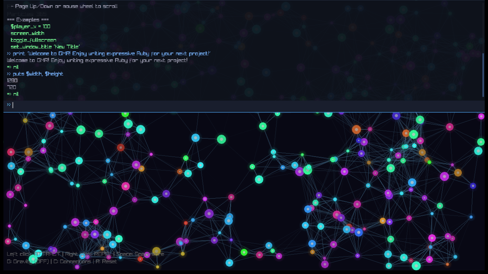

# GMR - Games Made with Ruby

A hot-reloadable game engine using mruby and raylib. Write your game logic in Ruby, see changes instantly without recompiling.



## Features

- **Hot Reload**: Edit Ruby scripts and see changes instantly
- **Handle-based Resources**: Safe resource management - Ruby never touches raw pointers
- **Virtual Resolution**: Render at retro resolutions, scale up automatically with letterboxing
- **Cross-platform**: Windows, Linux, macOS

## Quick Start

### Windows (MSYS2/MinGW64)

#### 1. Install MSYS2

Download and install from https://www.msys2.org/ (default path: `C:\msys64`)

#### 2. Install Dependencies

Open **"MSYS2 MINGW64"** from the Start menu (not MSYS2 MSYS!) and run:

```bash
# Update package database
pacman -Syu

# If terminal closes, reopen MSYS2 MINGW64 and run:
pacman -Su

# Install all dependencies
pacman -S \
    mingw-w64-x86_64-gcc \
    mingw-w64-x86_64-gdb \
    mingw-w64-x86_64-cmake \
    mingw-w64-x86_64-make \
    mingw-w64-x86_64-raylib \
    mingw-w64-x86_64-glfw \
    git \
    ruby \
    bison
```

#### 3. Build mruby (not available in pacman)

```bash
# Clone mruby
cd ~
git clone https://github.com/mruby/mruby.git
cd mruby

# Build
./minirake

# Install to MinGW64
cp build/host/lib/libmruby.a /mingw64/lib/
cp -r include/* /mingw64/include/
```

#### 4. Add MinGW64 to Windows PATH

1. Press `Win + R`, type `sysdm.cpl`, press Enter
2. Click **Advanced** tab → **Environment Variables**
3. Under **System variables**, find `Path`, click **Edit**
4. Click **New**, add: `C:\msys64\mingw64\bin`
5. Click **OK** on all dialogs
6. **Restart any open terminals/VS Code**

#### 5. Verify Installation

Open a **new** Command Prompt or PowerShell:

```cmd
g++ --version
cmake --version
mingw32-make --version
```

All three should show version information.

#### 6. Build GMR

```bash
# Clone or extract GMR
cd /path/to/gmr

# Configure
cmake -B build -G "MinGW Makefiles"

# Build
cmake --build build

# Run
./gmr.exe
```

### Linux (Ubuntu/Debian)

```bash
# Install build tools
sudo apt update
sudo apt install build-essential cmake git ruby bison

# Install raylib dependencies
sudo apt install libasound2-dev libx11-dev libxrandr-dev libxi-dev \
    libgl1-mesa-dev libglu1-mesa-dev libxcursor-dev libxinerama-dev

# Build raylib from source
git clone https://github.com/raysan5/raylib.git
cd raylib && mkdir build && cd build
cmake -DBUILD_SHARED_LIBS=OFF ..
make -j$(nproc)
sudo make install
cd ../..

# Build mruby from source
git clone https://github.com/mruby/mruby.git
cd mruby
make -j$(nproc)
sudo cp build/host/lib/libmruby.a /usr/local/lib/
sudo cp -r include/* /usr/local/include/
cd ..

# Build GMR
cd gmr
cmake -B build
cmake --build build
./gmr
```

### macOS

```bash
# Install Homebrew if needed
/bin/bash -c "$(curl -fsSL https://raw.githubusercontent.com/Homebrew/install/HEAD/install.sh)"

# Install dependencies
brew install cmake raylib mruby

# Build GMR
cd gmr
cmake -B build
cmake --build build
./gmr
```

## VS Code Setup (Recommended)

### Required Extensions

- **C/C++** (Microsoft) - IntelliSense and debugging
- **CMake Tools** (Microsoft) - CMake integration

### Opening the Project

1. Open VS Code
2. File → Open Folder → Select the `gmr` folder
3. CMake Tools will prompt to configure - select **"MinGW Makefiles"** and your compiler

### Building

- **Ctrl+Shift+B** - Build (default task)
- **F5** - Debug
- **Status bar** (bottom) - Click to select Debug/Release, build, etc.

## Project Structure

```
gmr/
├── CMakeLists.txt              # Build configuration
├── CMakePresets.json           # Build presets
├── include/gmr/                # C++ headers
│   ├── types.hpp               # Core types (Color, Vec2, handles)
│   ├── state.hpp               # Global state
│   ├── engine.hpp              # Master include
│   ├── resources/              # Resource managers
│   ├── bindings/               # mruby bindings
│   └── scripting/              # Script loading
├── src/                        # C++ implementation
├── scripts/                    # Ruby game code
│   └── main.rb                 # Entry point (edit this!)
├── .vscode/                    # VS Code configuration
└── build/                      # Build output (generated)
```

## Writing Games

Edit `scripts/main.rb` - changes are detected and reloaded automatically!

```ruby
def init
  # Called once at startup
  set_window_title("My Game")
  $player_x = screen_width / 2
  $player_y = screen_height / 2
end

def update(dt)
  # Called every frame, dt = delta time in seconds
  speed = 200 * dt
  $player_x -= speed if key_down?(263)  # LEFT
  $player_x += speed if key_down?(262)  # RIGHT
  $player_y -= speed if key_down?(265)  # UP
  $player_y += speed if key_down?(264)  # DOWN
end

def draw
  # Called every frame
  clear_screen(20, 20, 30)
  
  set_color(255, 100, 100)
  draw_circle($player_x.to_i, $player_y.to_i, 20)
  
  set_color(255, 255, 255)
  draw_text("Arrow keys to move", 10, 10, 20)
end
```

## Ruby API Reference

### Lifecycle

```ruby
def init          # Called once at startup
def update(dt)    # Called every frame (dt = seconds since last frame)
def draw          # Called every frame
```

### Graphics

```ruby
# Colors
set_color(r, g, b)              # Set drawing color (0-255)
set_color(r, g, b, a)           # With alpha
set_color([r, g, b])            # Array form
set_alpha(a)                    # Set alpha only
set_clear_color(r, g, b)        # Set background color

# Screen
clear_screen                    # Clear with set_clear_color
clear_screen(r, g, b)           # Clear with specific color

# Shapes
draw_rect(x, y, width, height)
draw_rect_lines(x, y, width, height)
draw_rect_rotate(x, y, width, height, angle)

draw_circle(x, y, radius)
draw_circle_lines(x, y, radius)
draw_circle_gradient(x, y, radius, [r1,g1,b1,a1], [r2,g2,b2,a2])

draw_line(x1, y1, x2, y2)
draw_line_thick(x1, y1, x2, y2, thickness)

draw_triangle(x1, y1, x2, y2, x3, y3)
draw_triangle_lines(x1, y1, x2, y2, x3, y3)

# Text
draw_text(text, x, y, font_size)
measure_text(text, font_size)   # Returns width in pixels
```

### Textures

```ruby
tex = load_texture("path/to/image.png")
draw_texture(tex, x, y)
draw_texture_ex(tex, x, y, rotation, scale)
draw_texture_pro(tex, src_x, src_y, src_w, src_h, dst_x, dst_y, dst_w, dst_h, rotation)
texture_width(tex)
texture_height(tex)
```

### Input - Keyboard

```ruby
key_down?(key)          # Is key currently held?
key_pressed?(key)       # Was key just pressed this frame?
key_released?(key)      # Was key just released this frame?
get_key_pressed         # Get last key pressed (or nil)
get_char_pressed        # Get last character pressed (or nil)
```

**Common Key Codes:**
| Key | Code | Key | Code |
|-----|------|-----|------|
| LEFT | 263 | RIGHT | 262 |
| UP | 265 | DOWN | 264 |
| SPACE | 32 | ENTER | 257 |
| ESCAPE | 256 | TAB | 258 |
| A-Z | 65-90 | 0-9 | 48-57 |
| F1-F12 | 290-301 | | |

### Input - Mouse

```ruby
mouse_x                     # X position
mouse_y                     # Y position
mouse_down?(button)         # Is button held? (0=left, 1=right, 2=middle)
mouse_pressed?(button)      # Was button just pressed?
mouse_released?(button)     # Was button just released?
mouse_wheel                 # Wheel movement this frame
```

### Audio

```ruby
sound = load_sound("path/to/sound.wav")
play_sound(sound)
stop_sound(sound)
set_sound_volume(sound, volume)  # 0.0 to 1.0
```

### Window

```ruby
screen_width                # Current screen width
screen_height               # Current screen height
set_window_size(w, h)
set_window_title(title)

toggle_fullscreen
set_fullscreen(true/false)
fullscreen?

monitor_count
monitor_width(index)
monitor_height(index)
monitor_refresh_rate(index)
monitor_name(index)

set_target_fps(fps)
get_fps                     # Current FPS
get_time                    # Time since start (seconds)
get_delta_time              # Time since last frame (seconds)
```

### Virtual Resolution

Render at a fixed low resolution, automatically scaled up:

```ruby
set_virtual_resolution(320, 240)    # Retro!
clear_virtual_resolution            # Back to native
virtual_resolution?                 # Is it enabled?
set_filter_point                    # Crisp pixels (default)
set_filter_bilinear                 # Smooth scaling
```

### Utility

```ruby
random_int(min, max)        # Random integer [min, max]
random_float                # Random float [0.0, 1.0)
quit                        # Exit the game
```

## Troubleshooting

### "cmake is not recognized" / "g++ is not recognized"

- Make sure `C:\msys64\mingw64\bin` is in your Windows PATH
- Restart your terminal/VS Code after adding to PATH

### "cannot find -lmruby"

mruby isn't installed. Follow the "Build mruby" steps above.

### "mruby.h: No such file"

mruby headers aren't installed. Make sure you ran:
```bash
cp -r include/* /mingw64/include/
```

### CMake can't find compiler

Specify it explicitly:
```bash
cmake -B build -G "MinGW Makefiles" \
    -DCMAKE_C_COMPILER=C:/msys64/mingw64/bin/gcc.exe \
    -DCMAKE_CXX_COMPILER=C:/msys64/mingw64/bin/g++.exe
```

### Scripts not reloading

- Make sure you're editing files in the `scripts/` folder
- Check the console for Ruby errors
- File must be saved (not just modified)

## License

MIT
